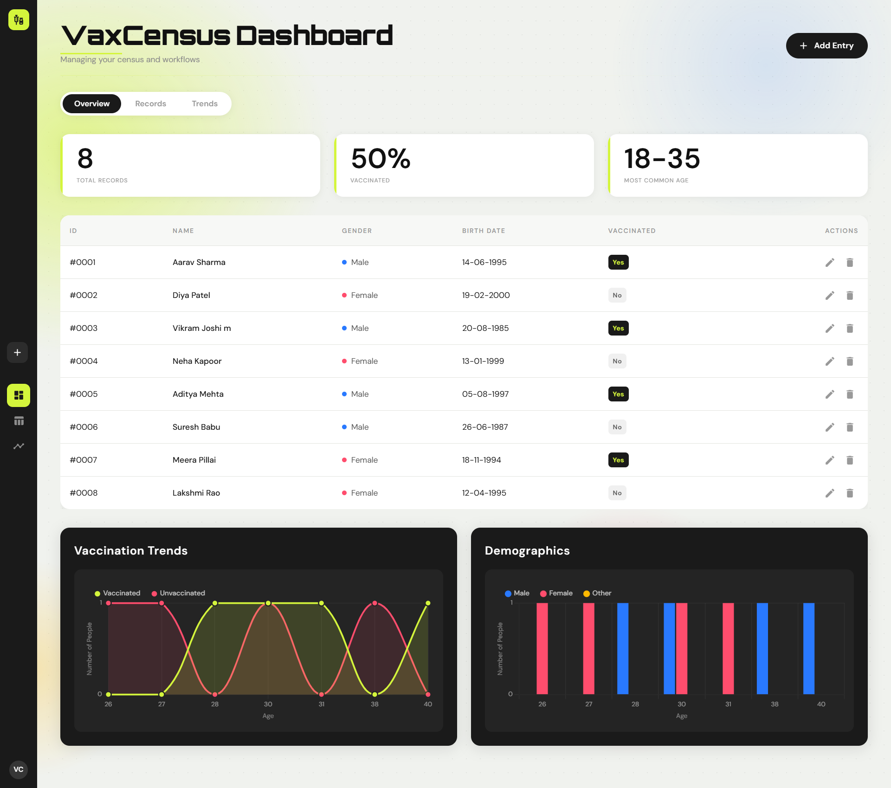

# 📊 Census Management System (VaxCensus)

A premium, modern SaaS dashboard for managing census records and vaccination tracking. Built with a robust Node.js backend and a high-performance React frontend, featuring dynamic charts, real-time statistics, and a sleek, responsive UI.




## ✨ Features

- **Dynamic KPI Cards:** Real-time tracking of total records, vaccination percentages, and common demographics.
- **Interactive Charts:** Visual trends for vaccination data and demographic distributions using Chart.js.
- **Census Management:** Full CRUD (Create, Read, Update, Delete) functionality for citizen records.
- **Modern UI/UX:** Built with React and Material UI, featuring glassmorphism, smooth animations, and a curated "DM Sans" typography system.
- **Robust Validation:** Comprehensive server-side and client-side validation for data integrity.
- **Search & Filtering:** Easily manage large datasets with built-in table controls.

## 🛠️ Technology Stack

### Frontend
- **React 18** (Vite-powered)
- **Material UI (MUI)** for professional design components
- **Chart.js** for interactive data visualization
- **React Hook Form** for efficient form management
- **Date-fns** for precise date manipulation

### Backend
- **Node.js & Express**
- **PostgreSQL** for relational data storage
- **Nodemon** for local development
- **Dotenv** for secure environment management

---

## 🚀 Getting Started

Follow these steps to set up the project locally.

### Prerequisites
- Node.js (v16.x or higher)
- PostgreSQL (v14.x or higher)
- npm or yarn

### 1. Clone the Repository
```bash
git clone https://github.com/your-username/census-management-system.git
cd census_management_system
```

### 2. Backend Setup
1. Navigate to the backend directory:
   ```bash
   cd backend
   ```
2. Install dependencies:
   ```bash
   npm install
   ```
3. Configure Environment Variables:
   - Create a `.env` file based on `.env.sample`.
   - Update `DB_USER`, `DB_PASSWORD`, and `DB_NAME` with your PostgreSQL credentials.
4. Initialize the Database:
   - Ensure PostgreSQL is running.
   - Run the migration scripts (if available) or create the `census_db` database.
5. Start the Server:
   ```bash
   npm run dev
   ```

### 3. Frontend Setup
1. Navigate to the frontend directory:
   ```bash
   cd ../frontend
   ```
2. Install dependencies:
   ```bash
   npm install
   ```
3. Start the Development Server:
   ```bash
   npm run dev
   ```
4. Open your browser to `http://localhost:5173`.

---

## 📁 Project Structure

```text
census_management_system/
├── backend/               # Express.js Server
│   ├── src/
│   │   ├── api/           # API routes
│   │   ├── config/        # DB and App config
│   │   └── middleware/    # Validation & Auth
│   └── index.js           # Entry point
├── frontend/              # React Application
│   ├── src/
│   │   ├── components/    # Reusable UI components
   │   │   ├── pages/         # Page-level components
   │   │   ├── api/           # Axios service layer
   │   │   └── utils/         # Helpers (date formatting, etc.)
│   ├── test/              # Jest unit tests for frontend (moved from src)
│   └── App.jsx            # Main app router
└── README.md              # Project documentation
```

## 🧪 Tests

- Backend tests are located in `backend/test/` and use Mocha + Chai + Supertest for route-level and middleware unit tests.
   - Run backend tests from the repository root:

```bash
cd backend
npm install
npm test
```

- Frontend tests are located in `frontend/test/` and use Jest + @testing-library/react for unit and hook tests. Test files use the `*.test.*` convention and are placed under `frontend/test/` (one file per unit under the `test` folder).
   - Run frontend tests from the repository root:

```bash
cd frontend
npm install
npm test -- --runInBand
```

If you want to include the screenshot shown above in the repository, save the provided image file as `frontend/public/vaxcensus-dashboard.png` (the README references that path). Using the public folder will ensure the image is available when the frontend is served and when GitHub renders the README.


## 🤝 Contributing

Contributions are welcome! Please feel free to submit a Pull Request or open an issue for any bugs or feature requests.

## 📄 License

This project is licensed under the MIT License.
